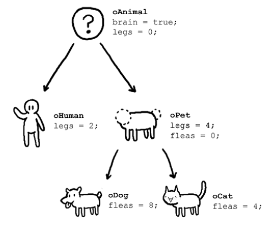

# 10장 객체 리터럴

# 10.1 객체란?

<aside>
💡

자바스크립트에서는 원시값을 제외한 존재하는 모든 것이 객체다

</aside>



- 원시타입의 값은 단 하나만 나타낸다. ex) boolean, int
- 원시 타입은 변경 불가능하지만 객체 타입은 변경이 가능하다
- 객체는 0개 이상의 프로퍼티(속성)으로 구성된 집합이며 프로퍼티는 키와 값으로 구성된다

```jsx
var oAnimal = {
	brain : true;    //이것들이 프로퍼티
	legs : 0;
}
```

- 프로퍼티 값이 함수일 경우 이를 메서드라고 한다
- 프로퍼티 : 객체의 상태를 나타내는 값
- 메서드 :  프로퍼티를 조회하고 조작할 수 있는 어떠한 동작, 행위

```jsx
var human = {
	  leg : 2,
    think : function(){    //이것이 메서드
        console.log("i am thinking...");
    }
};
```

# 10.2 객체 리터럴에 의한 객체 생성

- 자바스크립트는 프로토타입 기반 객체지향 언어로서 클래스 기반 객체지향 언어와는 달리 다양한 객체 생성 방법을 지원한다.
    - 객체 리터럴                              *가장 간단한 방법
    - Object 생성자 함수
    - 생성자 함수
    - Object create 메서드
    - 클래스
- 객체 리터럴은 중괄호 내부의 0개 이상의 프로퍼티를 정의

```jsx
var person = {
  name : 'Lee',
  sayHello : function(){
    console.log(`Hello! my name is {this.name}`);
  }
};

console.log(typeof person);           // object 
console.log(person);                  // {name: lee, sayHello : f}
```

- 객체 리터럴의 중괄호는 코드 블럭을 의미 하지 않으며 표현식이다.
- 따라서 선언 후에는 중괄호가 붙는다.

# 10.3 프로퍼티

- 객체는 프로퍼티의 집합이며 키와 값으로 구성된다

```jsx
var person = {
  name : 'Lee',  // 프로퍼티의 키 : 빈 문자열을 포함하는 모든 문자열 또는 심벌의 값 
  age : 20       // 프로퍼티의 값 : 자바스크립트에서 사용할 수 있는 모든 값 
}
```

- 식별자 네이밍을 따르지 않는 키의 경우 따옴표를 사용해야 한다

```jsx
var person = {
    firstName : 'Ung-mo',
    'last-name' : 'lee',
}
----------------------------------------------------------------
PS C:\Users\gkstj\IdeaProjects\study-log\src\main\resources> node .\index.js
{ firstName: 'Ung-mo', 'last-name': 'lee' }
```

- 프로퍼티 키를 동적으로 생성할 수도 있다. 이 경우엔 [] 객체에 대괄호를 붙여 키를 생성한다.

```jsx
var obj = {};
var key = 'hello';
obj[key] = 'world';
console.log(obj);
--------------------------------------------------------------------------
var obj = {};
var key = 'hello';
obj[key] = 'world';
console.log(obj);
```

- 프로퍼티 키에 문자열이나 심벌 외에 다른 값을 사용하면 암묵적 형변환으로 문자열로 변환한다.
- 따옴표는 붙지 않지만 내부적으로는 문자열이 된다.

```jsx
function getKeyTypes(obj) {
    return Object.keys(obj).map(key => ({
        key,
        type: typeof key
    }));
}

var obj = {
    123: 456,
    true: false,
};

console.log(getKeyTypes(obj));
--------------------------------------------------------------------------
PS C:\Users\gkstj\IdeaProjects\study-log\src\main\resources> node .\index.js
[ { key: '123', type: 'string' }, { key: 'true', type: 'string' } ]
```

- var, function, ‘’같은 예약어 밑 공백또한 key로 사용가능하나 에러가 있을 수 있으니 권장하진 않음
- 이미 존재하는 프로퍼티를 재선언 하면 덮어쓴다. 에러는 발생하지 않음

```jsx
var foo = {
    name : 'lee',
    name : 'han'
};

console.log(foo);
--------------------------------------------------------------------------
PS C:\Users\gkstj\IdeaProjects\study-log\src\main\resources> node .\index.js
{ name: 'han' }
```

# 10.4 메서드

- 자바스크립트는 함수 역시 값으로 사용 가능하다. 이에 경우 메서드라고 부른다
- 자바스크립트에서 함수는 일급 객체이다

<aside>
💡

새로 알게된 부분 : 일급 객체란? 

1. 모든 일급 객체는 변수나 데이터에 담을 수 있어야 한다.
2. 모든 일급 객체는 함수의 파라미터로 전달 할 수 있어야 한다.
3. 모든 일급 객체는 함수의 리턴값으로 사용 할수 있어야 한다

[https://inpa.tistory.com/entry/CS-👨‍💻-일급-객체first-class-object](https://inpa.tistory.com/entry/CS-%F0%9F%91%A8%E2%80%8D%F0%9F%92%BB-%EC%9D%BC%EA%B8%89-%EA%B0%9D%EC%B2%B4first-class-object)

</aside>

```jsx
// 1. 모든 일급 객체는 변수나 데이터에 담을 수 있어야 한다.
const hello = function() {
	console.log("Hello World");
}

// 2. 모든 일급 객체는 함수의 파라미터로 전달 할 수 있어야 한다.
const hello = function() {
	console.log("Hello World");
}

function print(func) {
	func();
}

print(hello);

// 3. 모든 일급 객체는 함수의 리턴값으로 사용할 수 있어야 한다
const hello = function() {
	console.log("Hello World");
    return function() {
    	console.log("Hello World 22");
    }
}

const hello2 = hello();
hello2();
```

# 10.5 프로퍼티 접근

- 프로퍼티에 접근하는 방법이 두 가지 있음
    - 마침표 프로퍼티 접근 연산자(.)를 사용한다
    - 대괄호 프로퍼티 접근 연산자([])를 사용한다
- 좌측에는 객체로 표현되는 평가식을 기술한다
- 우측에는 객체의 내부 프로퍼티 키를 기술한다

```jsx
var person = {
  name : 'han'
}

//마침표 표기법 
person.name 

//대괄호 표기법 
person['name'] //반드시 따옴표로 감싼 문자열이어야함 
```

- 없는 프로퍼티의 키로 접근하면 undefined를 return한다
- 프로퍼티키가 네이밍 규칙을 준수하지 않는경우 따옴표와 함께 대괄호로 접근해야 한다

```jsx
var person = {
    'last-name' : 'Lee',
    1 : 10
};

console.log(person['last-name']); // Lee
```

- 브라우저 환경에서는 NaN으로 출력


- nodejs에서는 Error 발생


<aside>
💡

last-name의 -는 식별자로 쓸 수 없다. 따라서 js엔진은 다음으로 이해한다 
(person.last) - (name)

- `person.last` → 객체 `person` 안에 `"last"`라는 key가 없음 → `undefined`
- `name` → 브라우저에서는 전역 객체(window)의 내장 속성으로 존재 (ex. `window.name`, 기본값은 빈 문자열 `""`)
- 따라서 `undefined - ""` → 숫자 연산으로 변환됨 → `NaN`

node.js에서는 전역객체 global의 name이 존재하지 않다. 
따라서 에러가 발생 

</aside>

# 10.6 프로퍼티 값 갱신

- 이미 존재하는 프로퍼티의 값을 갱신할 수 있다

```jsx
var person = {
    name : 'Lee'
};

person.name = "Kim";
console.log(person);
-----------------------------------------------------------------------------------------
PS C:\Users\gkstj\IdeaProjects\study-log\src\main\resources> node .\index.js
{ name: 'Kim' }
```

# 10.7 프로퍼티 동적 생성

- 존재하지 않는 프로퍼티에 값을 할당해서 동적으로 생성 가능하다

```jsx
var person = {
    name : 'Lee'
};

person.age = 10;
console.log(person);
-----------------------------------------------------------------------------------------
PS C:\Users\gkstj\IdeaProjects\study-log\src\main\resources> node .\index.js
{ name: 'Lee', age: 10 }
```

# 10.8 프로퍼티 삭제

- delete 연산자는 객체의 프로퍼티를 삭제한다
- 존재하지 않는 값의 경우 아무일도 일어나지 않는다

```jsx
var person = {
    name : 'Lee'
};

person.age = 10;
delete person.name;
console.log(person);
-----------------------------------------------------------------------------------------
PS C:\Users\gkstj\IdeaProjects\study-log\src\main\resources> node .\index.js
{ age: 10 }
```

# 10.9 ES6에서 추가된 객체 리터럴의 확장 기능

## 10.9.1 프로퍼티 축약 표현

```jsx
var x = 1, y = 2;
var obj = {
  x : x ,
  y : y 
}
console.log(obj);

const obj2 = {x, y};  //이렇게 축약해서 표현할 수 있다

console.log(obj2);
-----------------------------------------------------------------------------------------
PS C:\Users\gkstj\IdeaProjects\study-log\src\main\resources> node .\index.js
{ x: 1, y: 2 }
{ x: 1, y: 2 }
```

## 10.9.2 계산된 프로퍼티 이름

```jsx
var prefix = 'prop';
var i = 0;
var j  = 0;
var obj = {};

obj[prefix + '-' + ++i] = i;
obj[prefix + '-' + ++i] = i;
obj[prefix + '-' + ++i] = i;

const obj2 = {
    [`${prefix}-${j++}`] : j,
    [`${prefix}-${j++}`] : j,
    [`${prefix}-${j++}`] : j
}
console.log(obj);
console.log(obj2);

----------------------------------------------------------------------------------
PS C:\Users\gkstj\IdeaProjects\study-log\src\main\resources> node .\index.js
{ 'prop-1': 1, 'prop-2': 2, 'prop-3': 3 }
{ 'prop-0': 1, 'prop-1': 2, 'prop-2': 3 }
```

## 10.9.3 메서드 축약 표현

```jsx
const person = {
  name: "Lee",
  sayHi: function() {
    console.log("Hi! " + this.name);
  }
};

person.sayHi(); // Hi! Lee

const person = {
  name: "Lee",
  sayHi() {
    console.log("Hi! " + this.name);
  }
};

person.sayHi(); // Hi! Lee

```