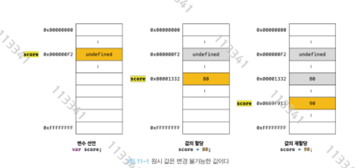

# 11장 원시 값과 객체의 비교

- 자바스크립트가 제공하는 타입은 원시타입과 객체타입으로 나뉜다
- 원시 타입은 변경 불가능한 값, 객체 타입은 변경 가능한 값이다.
- 원시 값을 변수에 할당하면 변수(확보된 메모리 공간)에는 실제 값이 저장
- 객체 값을 변수에 할당하면 변수에는 참조값이 저장된다
- 원시 값을 복사하면 새 변수에는 값이 저장되지만 객체 값을 복사하면 참조 값이 복사되어 저장된다

# 11.1 원시 값

## 11.1.1 변경 불가능한 값

- 원시 타입을 한번 생성하면 읽기만 가능한 값이 된다.
- 변경이 불가능하다는 것은 변수가 아닌 값에 대한 설명이 된다.
- 즉 변수 내부에 값은 교체할 수 있으나 내부 값에 대해서는 변경이 불가능하다.
- 변수와 반대 되는 개념인 상수는 재할당이 금지된 변수를 말한다.

```jsx
// const 키워드는 재할당이 금지된 변수이다.
const o = {};

// const 키워드를 사용해 변수에 할당한 원시 값(상수)은 변경할 수 없다.
// 하지만 const 키워드를 사용해 선언한 변수에 할당한 객체는 변경할 수 있다. 
o.a = 1;
console.log(o); // {a : 1}
```

### 원시값을 담은 변경 로직

1. 기존의 값을 담은 변수에 재할당을 한다.
2. 기존 값 80의 메모리는 유지한 채 재할당한 값의 위치를 이전 변수가 가리키게 한다 



<aside>
💡

불변성이란 값을 재할당할 값의 메모리 주소로 변수의 값주소를 변경하는 것을 말한다. 

</aside>

- 만약 원시값을 변경할 수 있다면 상태 변경의 추적이 어려워지게 된다

## 11.1.2 문자열과 불변성

- 원시값인 문자열은 다른 원시값과 비교할 때 독특한 특징이 있다
- 문자열은 0개 이상의 문자로 이루어진 집합을 의미한다
- 1개의 문자는 2바이트의 공간을 필요로 한다.
- 따라서 문자열은 몇개의 문자열로 구성돼 있느냐에 따라 메모리 공간의 크기가 결정된다.

```jsx
var str = 'Hello';   // 1. 메모리공간에 'Hello' 문자열 생성 
str = 'World';       // 2. 'Hello'는 유지한 채로 변수에 'World'에 위치 주소 저장 
```

<aside>
💡

유사배열 객체란 인덱스로 프로퍼티 값에 접근 가능하고, length 프로퍼티를 갖는 객체를 말한다. 

문자열이 그러하다

</aside>

```jsx
var str = "hello";
str[0] = "H";

console.log(str);   // 각각의 문자는 불변 객체이기 때문에 값이 변하지 않는다
-------------------------------------------------------------------------------------
PS C:\Users\gkstj\IdeaProjects\study-log\src\main\resources> node .\index.js
hello
```

- 그러나 변수에 새 문자열을 할당하는 것은 가능하다

## 11.1.3 값에 의한 전달

- score에 값을 copy에 전달하면 실제 메모리상에서는 어떻게 동작하는가?

```jsx
var score = 80;
var copy = score;

console.log(score);
console.log(copy);

score = 100;      //값에 의한 전달 

console.log(score);
console.log(copy);
-------------------------------------
PS C:\Users\gkstj\IdeaProjects\study-log\src\main\resources> node .\index.js
80
80
100
80
```


<aside>
💡

변수에는 사실 값이 전달되는것이 아닌 메모리 주소가 전달된다.

</aside>

<aside>
💡

한 변수에 값을 다른 변수에 할당할 때 

두 변수의 원시 값은 서로 다른 메모리 주소에 저장되어 각 변수로 메모리 주소값이 전달된다.

</aside>

# 11.2 객체

- 객체는 내부 프로퍼티의 수와 값이 유동적이기 때문에 메모리공간을 지정할 수 없다.

### 자바스크립트 객체의 관리 방식

- 자바스크립트 객체는 프로퍼티 키를 인덱스로 사용하는 해시테이블이라고도 할 수 있다.
- 대부분의 자바스크립트 엔진은 해시보다 더 나은 방법으로 객체를 구현한다


- 자바나 c에서도 객체는 존재하지만 사전 정의 이후에는 추가, 삭제가 불가능하다
- 자바스크립트는 가능하지만 이는 더 비용이 많이 드는 방식이다
- 따라서 js는 히든 클래스라는 방식을 통해 c++에 준하는 성능을 보장한다.

## 11.2.1 변경 가능한 값

- 객체는 원시 타입과 달리 변경가능한 값이라 한다

```jsx
//객체 선언 
var person = {
    name : 'Lee'
};
```

- 원시 값을 할당한 변수를 참조하면 메모리에 저장돼 있는 원시값에 접근한다.
- 하지만 객체를 할당한 변수를 참조하면 메모리에 저장돼 있는 참조값을 통해 실제 객체에 접근한다.


```jsx
var person = {
    name : 'Lee'
};

person.name = 'Kim'; // 값 변경 : 메모리와 달리 기존 프로퍼티의 속상 값을 변경한다.
person.age = 32; // 값 생성 

console.log(person);
```


- 객체는 담은 변수는 객체를 담은 변수를 참조하기에 다른 변수에서도 참조할 수 있다.
- 여러 개의 식별자가 하나의 객체를 지칭할 수 있다는 말이다.

## 11.2.2 참조에 의한 전달

```jsx
var person = {
    name : 'Lee'
};

var copy = person;
```


```jsx
var person = {
    name : 'Lee'
};

var copy = person;

console.log(copy === person);

copy.name = 'Kim';

person.address = 'Seoul';

console.log(copy);
console.log(person);
--------------------------------------------------------------------
PS C:\Users\gkstj\IdeaProjects\study-log\src\main\resources> node .\index.js
true
{ name: 'Kim', address: 'Seoul' }
{ name: 'Kim', address: 'Seoul' }
```

- 값에의한 전달과 참조에 의한 전달 모두 식별자가 기억하는 메모리에 있는 값을 복사한다.
- 다만 원시값이냐 참조값이냐에 차이만 있을 뿐이다.