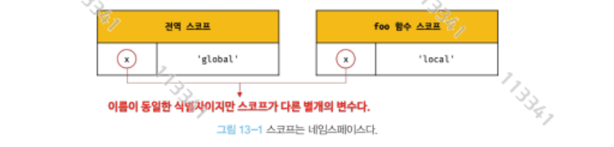

# 13장 스코프

# 13.1 스코프란?

- 자바스크립트를 포함 모든 언어의 기본적이며 중요한 개념
- var키워드와 let const로 선언한 변수는 각각 다르게 동작한다

```jsx
function add(x, y) {
  console.log(x, y);
  return x + y;
}

add(2, 5);
console.log(x, y);
--------------------------------------------------
$ node index.js 
2 5
C:\rcp\index.js:7
console.log(x, y);
            ^

ReferenceError: x is not defined
```

- 매개변수는 스코프내에서만 참조할 수 있다

- 모든 식별자는 자신이 선언된 위치에 의해 다른 코드가 식별자 자신을 참조할 수 있는 유효범위가 결정된다.
- 이름이 같은두 변수중에서 어떤 변수를 참조해야 할것인지 결정하는데 이를 식별자 규칙이라고 한다

<aside>
💡

코드가 어디서 실행되며 주변에 어떤 코드가 있는지를 렉시컬 환경이라고 한다 

</aside>



- 식별자는 유일해야 하며 하나의 값은 식별자에 연결되어야 한다
- 각 폴더에 있는 파일에 이름은 유일해야 한다. 이처럼 프로그래밍 언어에서는 스코프를 통해 식별자인 변수 이름의 충돌을 방지한다

```jsx
function foo() {
  var x = 1;           //var는 중복선언을 허용한다
  var x = 2;           //기존 값이 바뀌는 문제가 있다
  console.log(x);
}

foo();

function bar() {
  let x = 1;           //let은 중복선언을 허용하지 않는다 
  let x = 2;
  console.log(x);
}

bar();
-------------------------------------------------------------
hpe@DESKTOP-33SCBPI MINGW64 /c/rcp
$ node index.js 
C:\rcp\index.js:16
  let x = 2;
      ^
      
SyntaxError: Identifier 'x' has already been declared
```

# 13.2 스코프의 종류

- 코드는 전역과 지역으로 구분할 수 있다

| 구분 | 설명 | 스코프 | 변수 |
| --- | --- | --- | --- |
| 전역 | 코드의 가장 바깥 영역 | 전역 스코프 | 전역 변수 |
| 징젹 | 함수 몸체 내부  | 지역 스코프 | 지역 변수 |

## 13.2.1 전역과 전역 스코프

- 전역 변수는 어디서든 참조할 수 있다.


```jsx
// 🌐 전역 변수(Global Variable)
// 함수 바깥에서 선언된 변수 -> 모든 함수에서 접근 가능
let globalVar = "나는 전역 변수야!";

function exampleFunction() {
    // 📍 지역 변수(Local Variable)
    // 함수 안에서 선언된 변수 -> 함수 안에서만 접근 가능
    let localVar = "나는 지역 변수야!";
    
    console.log("함수 안에서 전역 변수 사용:", globalVar); 
    console.log("함수 안에서 지역 변수 사용:", localVar);
}

exampleFunction();

// 함수 밖에서 전역 변수 사용 가능
console.log("함수 밖에서 전역 변수 사용:", globalVar);

// ❌ 함수 밖에서는 지역 변수 접근 불가 → 오류 발생
// console.log(localVar);  // ReferenceError: localVar is not defined
```

## 13.2.2 지역과 지역 스코프

- 지역이란 함수 몸체 내부를 말한다
- 지역 변수는 자신의 지역 스코프와 하위 지역 스코프에서 유효하다
- inner 함수에서 x를 참조하면 내부 지역변수를 검색한다.
- 자바스크립트 엔진이 스코프 체인을 통해 참조할 변수를 검색했기 때문이다.

# 13.3 스코프 체인

- 함수 몸체 내부에서 함수가 정의된 것을 ‘함수의 중첩’이라고 한다.
- 내부의 함수를 중첩 함수, 외부의 함수를 외부 함수라고 한다
- 함수의 지역 스코프도 중첩될 수 있다. 즉 계층적구조를 갖는다


<aside>
💡

스코프가 계층적으로 연결된 것을 스코프 체인이라고 한다

</aside>

- 변수를 참조할 때 자바스크립트 엔진은 스코프 체인을 통해 변수를 참조하는 코드의 스코프에서 시작하여 상위 스코프 방향으로 이동하며 선언된 변수를 검색한다.
- 스코프 체인은 물리적으로 존재한다. 렉시컬 환경은 실제로 생성되어 스코프 체인을 구성한다

## 13.3.1 스코프 체인에 의한 변수 검색

- 상위 스코프에서 유효한 변수는 하위 스코프에서 자유롭게 참조할 수 있다
- 하위 스코프에서 유효한 변수는 상위 스코프에서 사용할 수 없다

## 13.3.2 스코프 체인에 의한 함수 검색

```jsx
function foo() {  // 함수선언시 foo라는 식별자(함수 이름과 동일) 암묵적 선언 및 생성 
  console.log('global function foo');
}

function bar() {
  function foo() {
    console.log('local function foo');   
  }
  foo();
}
//따라서 식별자 규칙과 동일하게 함수 검색 
bar();
```

# 13.4 함수 레벨 스코프

- 지역은 함수 몸체 내부를 말하고 지역은 지역 스코프를 만든다
- 코드블록이 아닌 함수에 의해서만 지역스코프가 생성된다는 의미
- C나 JAVA 등을 비롯한 대부분으 ㅣ피ㅡ로그래밍 언어는 모든 코드 블록(if, for, while, try/catch등 )이 지역 스코프를 만든다.
- 이를 블록 레벨 스코프라 한다
- 하지만 js에서 var 키워드로 선언된 변수는 오직 함수의 코드 블록만을 지역 스코프로 인정한다.
- 이를 함수 레벨 스코프라 한다

```jsx
var x = 1;
if (true) {
  var x = 10;  //지역변수로 인정되지 않음 
}
console.log(x); //10 x의 값이 변경됐다.

var i = 10;
for (var i = 0 ;i < 5; i ++){
  console.log(i); //0 1 2 3 4 
}

// 변수의 값이 변경됐다
console.log(i); // 5 
```

- var 키워드로 선언된 변수는 함수의 코드 블록만을 지역 스코프로 인정한다
- let, const 키워드는 블록 레벨 스코프를 지원한다

# 13.5 렉시컬 스코프

## 코드 분석

```jsx
var x = 1;

function foo() {
  var x = 10;    // foo 함수 안의 지역 변수
  bar();         // bar 호출
}

function bar() {
  console.log(x);
}

foo(); // (1)
bar(); // (2)

```

### 실행 흐름

1. `foo()` 실행
    - `foo` 내부에서 `x = 10`을 선언했지만,
        
        `bar()`는 **자신이 정의된 위치의 스코프(전역 스코프)를 기준**으로 변수를 찾습니다.
        
    - 따라서 `bar()` 내부의 `console.log(x)`는 `foo` 안의 `x`를 보지 않고 **전역 변수 `x = 1`*을 참조합니다.
    - 출력 결과: `1`
2. `bar()` 직접 실행
    - 마찬가지로 `bar` 함수는 전역에서 정의되었기 때문에 전역 변수 `x`를 참조합니다.
    - 출력 결과: `1`

---

## 핵심 개념

자바스크립트는 **렉시컬 스코프(lexical scope)** 규칙을 따릅니다.

즉, **함수가 "호출되는 위치"가 아니라 "정의된 위치" 기준으로 상위 스코프가 결정**돼요.

그래서 `bar` 함수는 `foo` 안에서 호출되더라도 `foo`의 `x = 10`을 볼 수 없고,

자신이 정의된 전역 스코프에 있는 `x = 1`을 참조하게 됩니다.