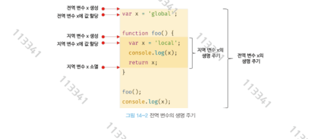

# 14장 전역변수의 문제점

# 14.1 변수의 생명주기

- 변수는 생명주기를 갖는다
- 프로그램이 종료되지 않는 한 변수는 무한히 메모리 공간을 점유한다
- 지역 변수의 생명주기는 함수의 생명주기와 일치한다

```jsx
function foo(){        // 변수의 생명주기 
    var x = 'local';   // 변수 x 생성 
    console.log(x);
    return x;          // 변수 x 소멸 
}

foo();
console.log(x);
-------------------------------
C:\Users\gkstj\vscode\index.js:8
console.log(x);
            ^

ReferenceError: x is not defined
    at Object.<anonymous> (C:\Users\gkstj\vscode\index.js:8:13)
```

- 함수가 종료하면 내부 지역 변수도 종료된다
- 함수가 종료하면 함수가 생성한 스코프도 종료된다
- 하지만 누군가 스코프를 참조하고 있다면, 스코프는 해제되지 않고 생존한다.

```jsx
var x = 'global';

function foo(){  //스코프가 시작할때 내부 변수 호이스팅 x = undefined
    console.log(x);    // undefined를 출력 
    var x = 'local';
}

foo();
console.log(x);       // 'global'를 출력
```

- 호이스팅은 스코프를 단위로 동작한다.
- 호이스팅은 변수 선언이 스코프의 선두로 끌어 올려진 것처럼 동작하는 자바스크립트 고유의 특징을 말한다

## 14.1.2 전역변수의 생명주기

- var 키워드로 선언한 전역변수는 전역객체의 프로퍼티가 된다
- 이는 전역변수의 생명주기가 전역객체의 생명주기와 일치함을 말한다.

<aside>
💡

전역 객체는 표준 빌트인 객체, 환경에 따른 호스트 객체, var키워드로 선언한 전역 변수, 전역함수를 프로퍼티로 갖는다

</aside>



# 14.2 전역 변수의 문제점

### 암묵적 결합

- 코드 어디서든 사용할 수 있는 변수를 선언하는 의미에서 암묵적으로 결합을 허용한다
- 유효 범위가 커질 수록 가독성이 나빠지고 상태가 변할 수 있다

### 긴 생명주기

- 전역변수는 생명주기가 길다. 따라서 메모리 리소스도 오랜기간 차지한다.
- 또한 전역변수 var는 재할당이 가능하므로 더 긴 생명주기를 가질 수 있다

### 스코프 체인 상에서 종점에 존재

- 스코프 체인 상 가장 종점에 존재하며 이는 전역변수의 검색속도가 가장 느림을 의미한다

### 네임스페이스 오염

- 파일이 분리되어 있어도 하나의 전역 스코프를 공유한다는 것이다.
- 예상치 못한 결과를 가져올 수 있다

# 14.3 전역 변수의 사용을 억제하는 방법

<aside>
💡

전역변수를 사용해야 할 이유가 없다면 지역변수를 사용해야한다. 변수의 스코프는 좁을수록 좋다.

</aside>

## 14.3.1 즉시 실행 함수

- 모든 코드를 즉시 실행함수로 감싸면 모든 변수는 즉시 실행 함수의 변수가 된다

```jsx
(function() {
    var foo = 10;

}());

console.log(foo);
---------------------------------------------
C:\Users\gkstj\vscode\index.js:6
console.log(foo);
            ^

ReferenceError: foo is not defined
```

## 14.3.2 네임 스페이스 객체

- 전역에 네임스페이스 역할을 담당할 객체를 생성
- 전역변수로 사용할 값을 프로퍼티에 추가
- 식별자 충돌을 방지하는 효과는 있으나 네임스페이스 객체가 전역 변수에 할당되므로 유용해보이진 않음

## 14.3.3 모듈 패턴

- 모듈 패턴은 클래스를 모방하여 관련있는 함수와 변수를 모아 즉시 실행함수로 감싸 하나의 모듈로 만든다
- 모듈 패턴은 자바스크립트의 강력한 기능인 클로저라는 기능을 통해 동작한다.
- 클로저를 통해 전역변수를 방지할 수 있다고만 생각해두자

```jsx
var Counter = (function () {
    var num = 0;

    return {
        increase () {
            return ++num;
        },
        decrease () {
            return --num;
        }
    };
}());

console.log(Counter.num);      // undefined
console.log(Counter.increase()); // 1
console.log(Counter.increase()); // 2
console.log(Counter.decrease()); // 1
-----------------------------------------------------------------------------
PS C:\Users\gkstj\vscode> node .\index.js
undefined
1
2
1
```

## 14.3.4 ES6 모듈

- ES6 모듈을 사용하면 전역변수를 사용할 수 없다
- ES6 모듈은 파일 자체의 독자적인 모듈 스코프를 제공한다.
- 모던 브라우저에서는 ES6 모듈을 사용할 수 있다
- script 태그에 type=”module” 어트리뷰트를 추가하면 자바스크립트 파일이 모듈로써 동작한다

```jsx
<script type="module" src="lib.mjs"></script>
```