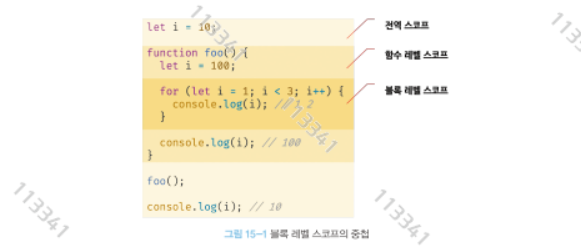

# 15장 let, const 키워드와 블록 레벨 스코프

# 15.1 var 키워드로 선언한 변수의 문제점

- ES5까지 변수를 선언할 유일한 방법은 var 키워드 뿐이었다
- var 키워드로 선언한 변수는 다음과 같은 특징이 있다.

## 15.1.1 변수의 중복 선언 허용

```jsx
var x = 1;
var y = 1;

var x = 100;
var y; // 초기화문이 없는 변수 선언문은 무시된다 
console.log(x);
console.log(y);
```

## 15.1.2 함수 레벨 스코프

- var 키워드로 선언한 변수는 오로지 함수의 코드블록만을 지역 스코프로 인정한다.
- 함수 외부의 var키워드로 선언한 변수는 코드블록 내부에서 선언해도 모두 전역변수가 된다

```jsx
var x  = 1;
if(true){
    //x는 전역변수이다. 그러나 아래에서 중복 선언된다 
    //의도치 않게 값이 변형된다
    var x = 100;
}
console.log(x);
```

- for문에서 var키워드로 선언한 변수도 전역변수가 된다.

```jsx
var i = 10;
for(var i =0; i < 5; i++){
    console.log(i);
}
console.log(i);

// Output: 5
```

## 15.1.3 변수 호이스팅

- var 키워드로 변수를 선언하면 변수 호이스팅에 의해 변수 선언문이 선두로 끌어 올려진 것처럼 동작한다

# 15.2 let 키워드

- 앞에 살펴본 var의 단점을 해결하기 위해 ES6에 let과 const를 도입했다

## 15.2.1 변수 중복 선언 금지

- let 키워드로 중복선언 시 에러가 발생한다

```jsx
var foo = 100;
var foo = 20;

let bar = 30;
let bar = 40;
-----------------------------------------------------------
C:\Users\gkstj\vscode\index.js:5
let bar = 40;
    ^

SyntaxError: Identifier 'bar' has already been declared
```

## 15.2.2 블록레벨 스코프

- var 키워드로 선언한 변수는 오로지 함수의 코드 블록만을 지역 스코프로인정하는 함수레벨 스코프를 따름
- let 키워드로 선언한 변수는 모든 코드 블록을 지역 스코프로 인정하는 블록레벨 스코프를 따름

```jsx
let foo = 1 //전역변수 
{
    let foo = 2 //지역변수
    let bar = 3
}
console.log(foo) //1
console.log(bar) //ReferenceError: bar is not defined;
```



## 15.2.3 변수 호이스팅

- var와 달리 let은 변수 호이스팅이 발생하지 않는것처럼 동작한다

```jsx
console.log(foo); //ReferenceError : foo is not defined
let foo; 
```

- var 키워드로 선언한 변수는 런타임 이전에 자바스크립트 엔진에 의해 암묵적으로 “선언”과 “초기화”단계가 한번에 진행
- 즉 선언 단계에서 스코프(실행 컨텍스트에 렉시컬 환경)에 변수를 등록해 자바스크립트 엔진에 변수의 존재를 알린다
- let키워드로 선언한 변수는 선언과 초기화가 분리되어 진행된다.

```jsx
console.log(foo);

let foo;
console.log(foo);

foo = 1;
console.log(foo);
-----------------------------------------------------------------------------------
PS C:\Users\gkstj\vscode> node .\index.js
C:\Users\gkstj\vscode\index.js:1
console.log(foo);
            ^

ReferenceError: Cannot access 'foo' before initialization
```


- 만약 초기화 단계가 실행되기 이전에 변수에 도달하려고 하면 참조 에러가 발생한다
- let 키워드로 선언한 변수는 스코프의 시작지점부터 초기화단계 시작지점 까지 변수를 참조할 수 없다.
- 결국 let 키워드는 변수를 호이스팅 하지 않는것처럼 보이나 사실 그렇지는 않다

```jsx
let foo = 1;
{ 
  console.log(foo); //실제로 변수 호이스팅이 되지 않았다면 여기선 전역변수를 출력해야함 
  let foo = 2;      //블록 스코프에서 하단에 foo가 선언되었고 이를 호이스팅하기에 지역변수를 가져오려함 
                    //그러나 let은 초기화를 해야 참조가 가능하기에 에러가 발생하는 것
}
-------------------------------------------------------------
PS C:\Users\gkstj\vscode> node .\index.js
C:\Users\gkstj\vscode\index.js:3
  console.log(foo);
              ^

ReferenceError: Cannot access 'foo' before initialization
```

- 자바스크립트 엔진은 ES6에 도입된 let과 const를 포함한 모든 선언을 호이스팅한다.

## 15.2.4 전역 객체와 let

- var 키워드로 선언한 값들은 전역객체 window에 프로퍼티가 된다 (브라우저)
- 전역 객체 프로퍼티를 참조할 때 window를 생략할 수 있다


- 그러나 let키워드로 선언한 변수는 전역객체의 프로퍼티가 아니기에 window.foo와 같이 접근할 수 없다
- let 전역변수는 보이지 않는 개념적인 블록 내에 존재하게 된다


# 15.3 const 키워드

- const 키워드는 상수를 위해 사용한다.
- const만에 다른 용도는 후반부에 알아보자

## 15.3.1 선언과 초기화

- const 키워드로 선언한 변수는 반드시 선언과 동시에 초기화 해야한다
- let과 마찬가지로 블록 레벨 스코프를 가진다

```jsx
const foo; // SyntexError 
```

## 15.3.2 재할당 금지

- var 또는 let은 재할당이 가능하나 const는 재할당이 불가능하다

```jsx
const foo = 1;
foo = 2; // TypeError 
```

## 15.3.3 상수

- 변수의 상대 개념인 상수는 재할당이 금지된 변수를 말한다.
- 가독성과 유지보수를 위해 사용되기 좋다

```jsx
// 역할이 명확한 상수 선언
const USER_TYPE = {
  STUDENT: "STUDENT",
  VIP: "VIP",
  NORMAL: "NORMAL"
};

const DISCOUNT_RATE = {
  STUDENT: 0.8,
  VIP: 0.7,
  NORMAL: 1.0
};

function calculateDiscount(price, type) {
  return price * (DISCOUNT_RATE[type] || 1.0);
}

console.log(calculateDiscount(10000, USER_TYPE.STUDENT)); // 8000
console.log(calculateDiscount(10000, USER_TYPE.VIP));     // 7000
console.log(calculateDiscount(10000, USER_TYPE.NORMAL));  // 10000
```

## 15.3.4 const 키워드와 객체

- const 키워드로 선언된 변수에 객체를 할당할 경우 객체의 프로퍼티는 변경될 수 있다

```jsx
// const로 선언된 객체
const user = {
  name: "Alice",
  age: 25
};

console.log(user); 
// { name: "Alice", age: 25 }

// 객체 프로퍼티 값 변경 (가능)
user.age = 26;
console.log(user); 
// { name: "Alice", age: 26 }

// 새로운 프로퍼티 추가 (가능)
user.email = "alice@example.com";
console.log(user); 
// { name: "Alice", age: 26, email: "alice@example.com" }

// 객체 자체를 재할당하려고 하면 ❌ 에러 발생
user = { name: "Bob", age: 30 }; 
// TypeError: Assignment to constant variable.
```

# 15.4 var , let, const

| 구분 | var | let | const |
| --- | --- | --- | --- |
| **스코프** | 함수 스코프(function scope) | 블록 스코프(block scope) | 블록 스코프(block scope) |
| **재선언** | 가능 (같은 스코프 내에서 중복 선언 허용) | 불가능 | 불가능 |
| **재할당** | 가능 | 가능 | 불가능 (단, 객체/배열의 내부 값 변경은 가능) |
| **호이스팅** | 선언과 초기화가 함께 호이스팅 → `undefined`로 초기화됨 | 선언만 호이스팅, 초기화는 호이스팅되지 않음 (TDZ 존재) | 선언만 호이스팅, 초기화는 호이스팅되지 않음 (TDZ 존재) |
| **초기화 여부** | 선언 시 초기화하지 않아도 됨 | 선언 시 초기화하지 않아도 됨 | 반드시 선언과 동시에 초기화해야 함 |

`TDZ`는 **Temporal Dead Zone (일시적 사각지대)** 의 약자예요.

자바스크립트에서 **`let`과 `const`로 선언한 변수가 초기화되기 전까지 접근할 수 없는 구간**을 의미합니다.

---

## 📌 TDZ 동작 원리

1. `let`과 `const` 변수도 사실 **호이스팅(선언 끌어올림)** 은 됩니다.
    - 즉, 자바스크립트 엔진이 스코프의 맨 위로 선언 자체는 끌어올려요.
2. 하지만 `var`처럼 `undefined`로 초기화되지 않고, **초기화되기 전까지 TDZ에 존재**하게 됩니다.
3.